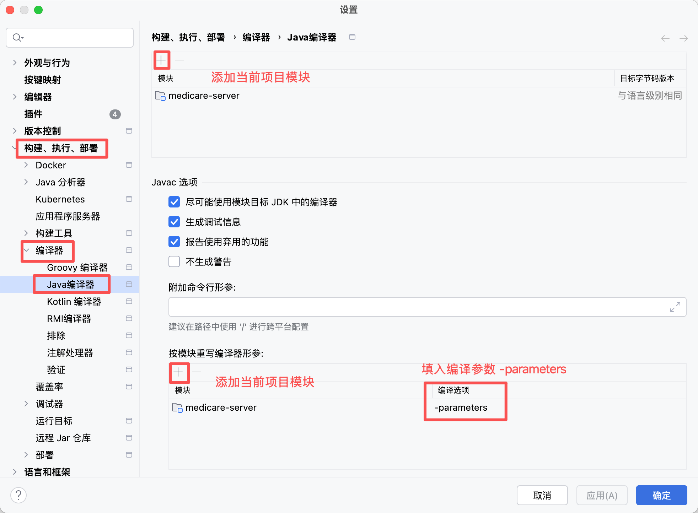

# MediCare 智慧医疗门诊管理系统 - 部署手册

## 目录

1. [系统概述](#1-系统概述)
2. [环境要求](#2-环境要求)
3. [数据库部署](#3-数据库部署)
4. [后端服务部署 (medicare-server)](#4-后端服务部署-medicare-server)
5. [前端应用部署 (medicare-web)](#5-前端应用部署-medicare-web)
7. [启动验证](#7-启动验证)
8. [常见问题排查](#8-常见问题排查)
9. [运维建议](#9-运维建议)

---

## 引言

项目概述：

medicare-server是后端服务项目，功能和代码完整版，部署好数据库，改好数据库连接和项目配置，即可运行。

medicare-server-archetype是后端服务项目，service和controller的功能代码需要完成开发，只保留了注释、注解、方法声明。方法体为实战项目。

medicare-web是前端服务项目，基于node.js和npm完成搭建，依赖也是下载完整的，可通过npm run dev直接运行。

## 1. 系统概述

MediCare 是一个智慧医疗门诊管理系统，包含两个核心项目：

| 项目 | 技术栈 | 默认端口 | 描述 |
|------|--------|----------|------|
| **medicare-server** | Spring Boot 3 + JPA + MySQL | 8080 | 后端 REST API 服务 |
| **medicare-web** | Vue 3 + TypeScript + Element Plus | 5173（开发）/ Nginx（生产） | 前端单页应用 |

---

## 2. 环境要求

### 2.1 开发环境

| 组件 | 版本 | 说明 |
|------|------|------|
| JDK | 17+ | 后端运行环境 |
| Node.js | 18+ | 前端运行环境 |
| MySQL | 8.0+ | 数据库服务 |


## 3. 数据库部署

### 3.1 创建数据库

```bash
# 登录 MySQL
mysql -u root -p

# 创建数据库（字符集必须为 utf8mb4）
CREATE DATABASE IF NOT EXISTS medicare
    CHARACTER SET utf8mb4
    COLLATE utf8mb4_unicode_ci;
```

### 3.2 导入基本数据

```bash
# 执行 SQL 脚本（从项目根目录）
mysql -u root -p medicare < sql/medicare.sql

```

### 3.3 数据库配置说明

| 参数 | 默认值 | 说明 |
|------|--------|------|
| 数据库名 | medicare | 固定 |
| 用户名 | root | 固定 |
| 密码 | 本机数据库密码 | 本机数据库密码 |
| 端口 | 3306 | MySQL 默认端口 |

---

## 4. 后端服务部署 (medicare-server)

### 4.1 开发环境配置



### 4.2 配置文件说明

**文件路径**：`medicare-server/src/main/resources/application.yml`

**关键配置项**：

```yaml
server:
  port: 8080                    # 服务端口

spring:
  datasource:
    url: jdbc:mysql://localhost:3306/medicare?useSSL=false&serverTimezone=Asia/Shanghai&characterEncoding=UTF-8&allowPublicKeyRetrieval=true
    username: root              # 数据库用户名（根据本机环境修改）
    password: a123456.          # 数据库密码（根据本机环境修改）
    driver-class-name: com.mysql.cj.jdbc.Driver
    hikari:
      maximum-pool-size: 20     # 最大连接数
      minimum-idle: 5           # 最小空闲连接

logging:
  level:
    com.medicare: debug         # 业务日志级别
    org.hibernate.SQL: debug    # SQL 日志级别（生产环境建议关闭）
```

**生产环境配置建议**：

| 配置项 | 建议值 | 说明 |
|--------|--------|------|
| server.port | 8080 | 保持默认 |
| datasource.username | medicare | 使用专用数据库用户 |
| datasource.password | 强密码 | 包含大小写字母、数字、特殊字符 |
| logging.level.com.medicare | info | 生产环境降低日志级别 |
| logging.level.org.hibernate.SQL | warn | 生产环境关闭 SQL 日志 |

---

## 5. 前端应用部署 (medicare-web)

### 5.1 开发环境运行

```bash
# 进入前端目录
cd medicare-web

# 安装依赖
npm install

# 开发模式运行（自动代理到 localhost:8080）
npm run dev

# 访问地址：http://localhost:5173
```


#### 开发环境代理配置说明

开发环境通过 Vite 代理转发 API 请求：

```typescript
// vite.config.ts
server: {
  port: 5173,
  proxy: {
    '/api': {
      target: 'http://localhost:8080',
      changeOrigin: true,
    },
  },
},
```

生产环境无需代理，通过 Nginx 统一配置。

---

### 5.2 登录验证

1. 访问：`http://localhost:5173/`
2. 使用默认账号登录：
   - 用户名：`admin`
   - 密码：`12345`
3. 登录成功后应跳转到首页 Dashboard

---

## 6. 常见问题排查

### 6.1 数据库连接失败

**现象**：后端启动报错 `Connection refused` 或 `Access denied`

**排查步骤**：

1.检查项目中application.yml中数据库连接信息是否配置正确。

### 8.2 前端无法访问

**现象**：前端启动失败

**排查步骤**：

1.检查项目通过npm run dev启动后，是否有控制台报错。

2.清理缓存重试。

3.检查前端项目依赖是否完整。

### 8.3 Session 认证问题

**现象**：登录成功后刷新页面需要重新登录

**排查步骤**：

1. 检查浏览器是否阻止了 Cookie（Session 需要 Cookie 支持）
3. 检查后端配置是否正确配置了 Session

## 附录：默认账号

| 用户名 | 密码 | 角色 | 说明 |
|--------|------|------|------|
| admin | 12345 | admin | 系统管理员 |


---

## 附录：端口占用

| 端口 | 服务 |
|------|------|
| 5173 | medicare-web |
| 8080 | medicare-server |
| 3306 | MySQL |

---

## 附录：目录结构

```
/opt/medicare/
├── server/                    # 后端部署目录
│   └── medicare-server-1.0.0-SNAPSHOT.jar
├── web/                       # 前端静态资源
│   ├── index.html
│   ├── assets/
│   └── ...
├── backup/                    # 数据库备份目录
└── scripts/                   # 运维脚本
    └── backup.sh
```
